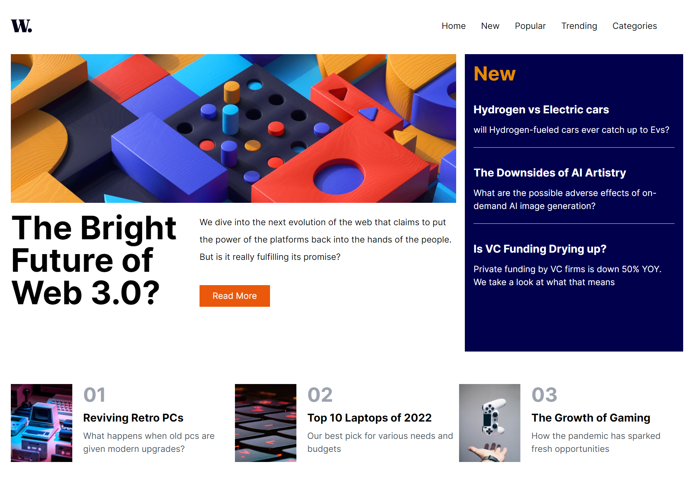
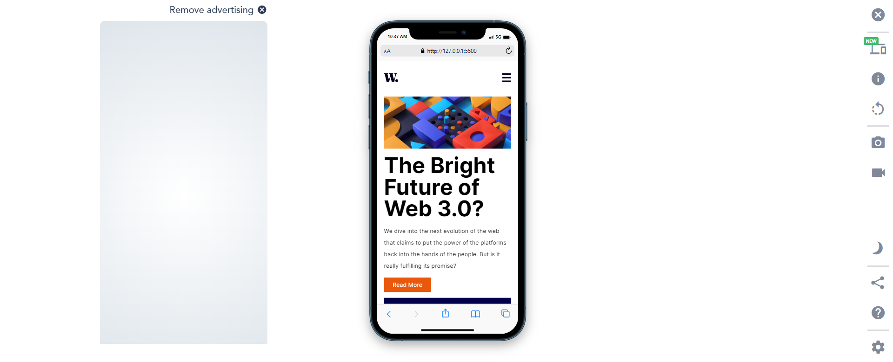

# Frontend Mentor - News homepage solution

This is a solution to the [News homepage challenge on Frontend Mentor](https://www.frontendmentor.io/challenges/news-homepage-H6SWTa1MFl). Frontend Mentor challenges help you improve your coding skills by building realistic projects. 

## Table of contents

- [Overview](#overview)
  - [The challenge](#the-challenge)
  - [Screenshot](#screenshot)
  - [Links](#links)
- [My process](#my-process)
  - [Built with](#built-with)
  - [What I learned](#what-i-learned)
  - [Useful resources](#useful-resources)
- [Author](#author)

## Overview

### The challenge

Users should be able to:

- View the optimal layout for the interface depending on their device's screen size
- See hover and focus states for all interactive elements on the page

### Screenshot

### Links

- Solution URL: [Add solution URL here](https://github.com/Emmykally/FEM-news-website.git)
- Live Site URL: [Add live site URL here](https://your-live-site-url.com)

## My process

### Built with

- Semantic HTML5 markup
- Tailwind Utility Classes
- Tailwind Flexbox
- Tailwind CSS Grid
- Mobile-first workflow
- Javascript

**Note: These are just examples. Delete this note and replace the list above with your own choices**

### What I learned

### Useful resources

- [Tailwind Documentation site](https://www.tailwind.com) - This helped me to grasp the way tailwind works. I really liked this framework and will use it going forward.

## Author

- Frontend Mentor - [@Emmykally](https://www.frontendmentor.io/profile/Emmykally)
- Twitter - [@emmykally](https://www.twitter.com/emmykally)

# FEM-news-website
